# 📊 Digital Library Audit System (SQL)

This project is a SQL-based system designed to manage and analyze a digital library.  
It focuses on tracking books, users, and transactions, along with identifying late returns and calculating fines.

The main goal of this project is to demonstrate how SQL can be used not just for storing data, but also for extracting meaningful insights.

---

## 🚀 Project Overview

In this system, we maintain three main entities:

- 📚 Books  
- 👤 Users  
- 🔄 Transactions  

Using these, we can:
- Track which books are issued or available  
- Monitor user activity  
- Identify overdue returns  
- Calculate fines for delays  
- Generate useful reports using SQL queries  

---

## 🛠️ Technologies Used

- MySQL
- SQL (DDL, DML, Joins, Aggregations, Functions)

---

## 📁 Project Structure
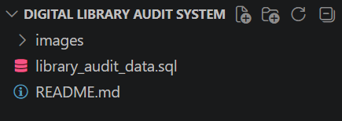

---

## 📸 Project Screenshots

### 🔹 Database Creation
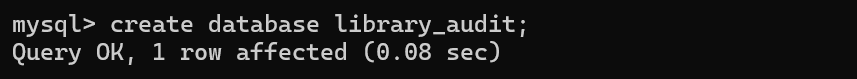

### 🔹 Using Database
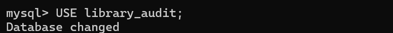

### 🔹 Tables Created
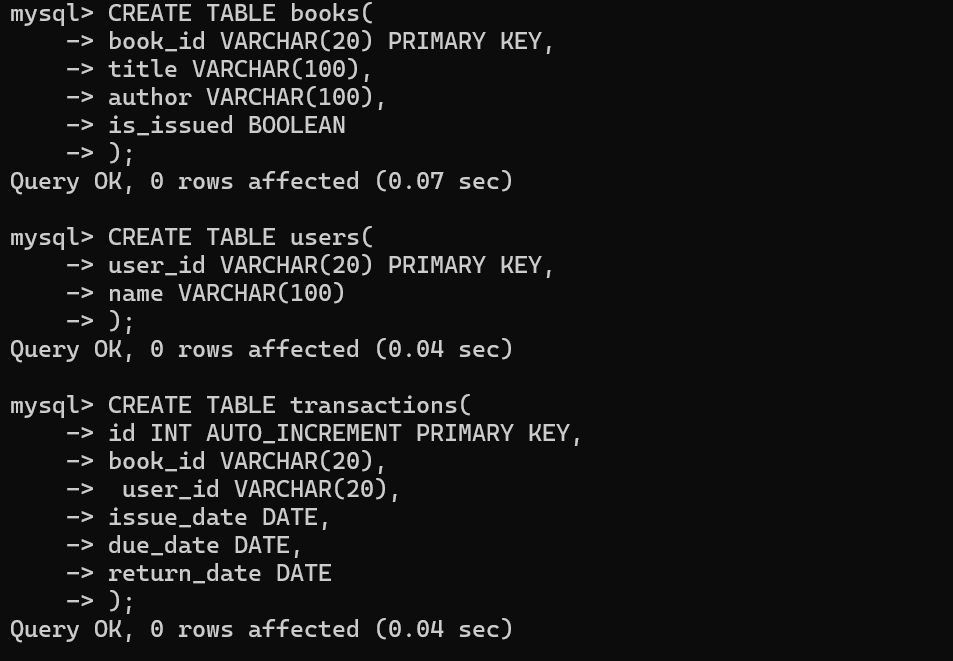

---

### 🔹 Data Insertion

#### Books
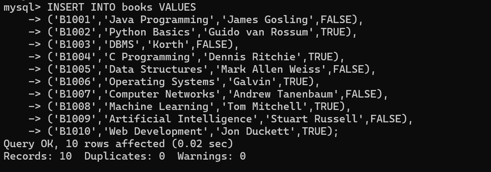

#### Users
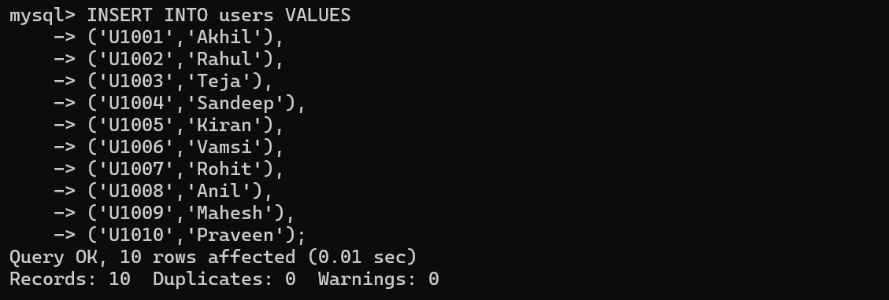

#### Transactions
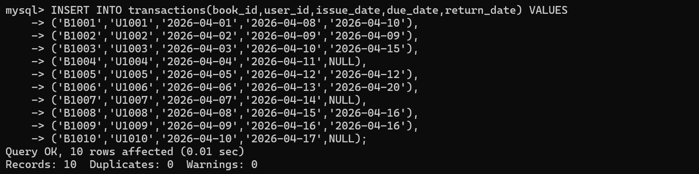

---

### 🔹 Tables Output

#### Books Table
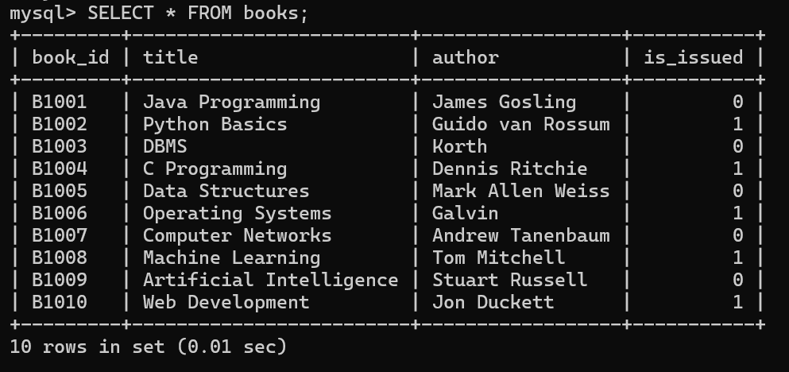

#### Users Table
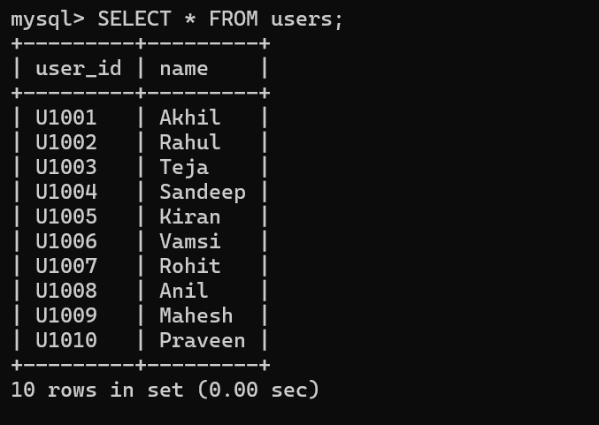

#### Transactions Table
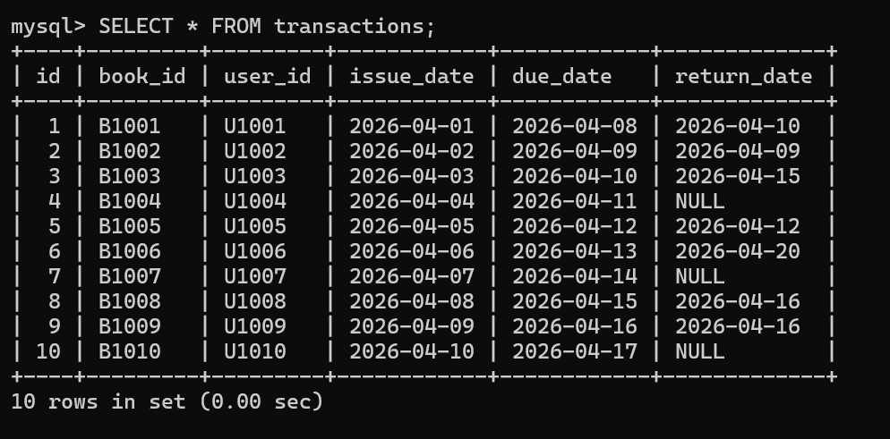

---

### 🔹 Analysis Queries

#### Available Books
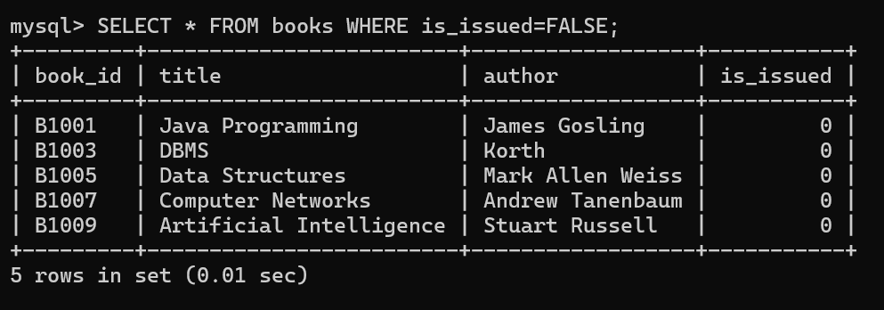

#### Issued Books
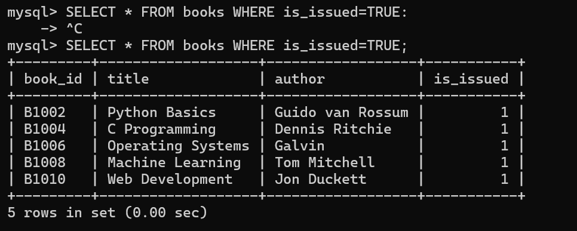

#### Currently Issued Books
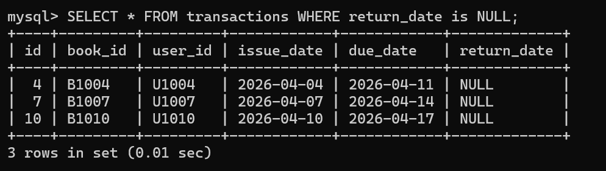

#### Late Returners
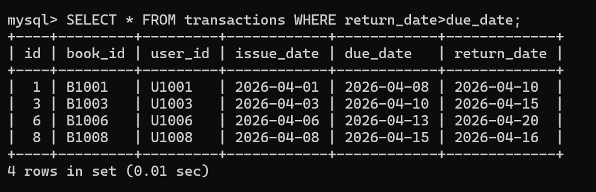

#### Fine Calculation
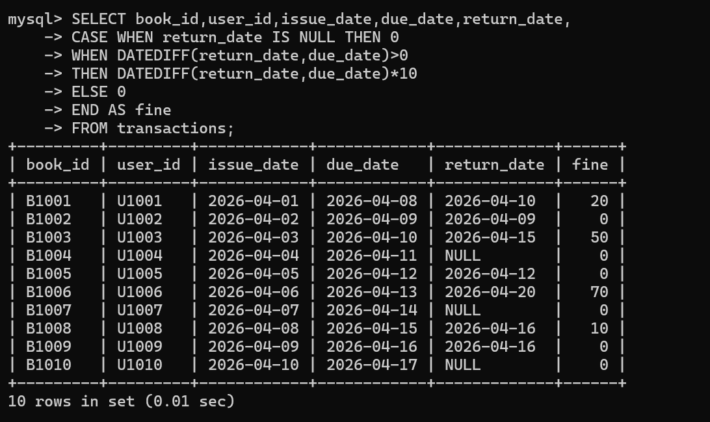

---

### 🔹 Advanced Queries

#### Join Operations
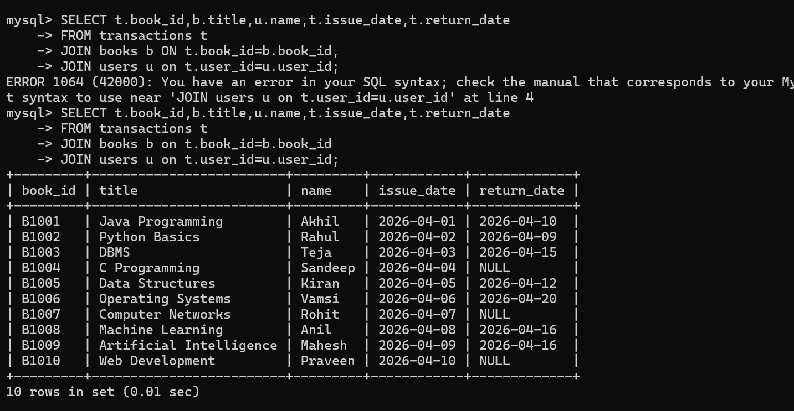

#### Most Issued Books
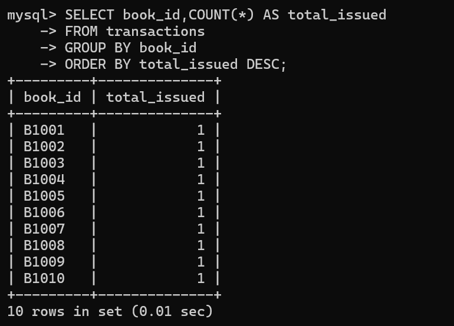

#### Most Borrowing Users
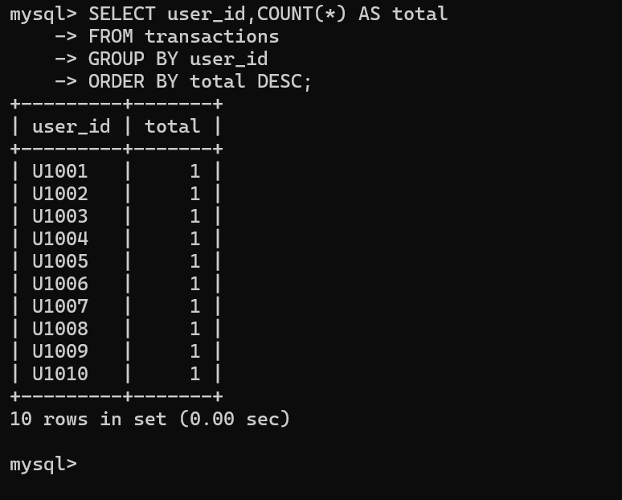

---

## 🧠 Concepts Covered

This project demonstrates:

- Table creation and relationships  
- Data insertion and management  
- Filtering and conditional queries  
- JOIN operations for combining data  
- Aggregate functions  
- Date functions and fine calculation logic  

---

## 🎯 Key Learnings

- How real-world systems store and track data  
- How SQL helps in analyzing patterns and reports  
- Importance of structured database design  
- Writing efficient queries for real scenarios  

---

## 👨‍💻 Author

**Akhilanandateja Sanga**

---

## 📌 Note

All SQL queries used in this project are available in the `library_audit_queries.sql` file.
